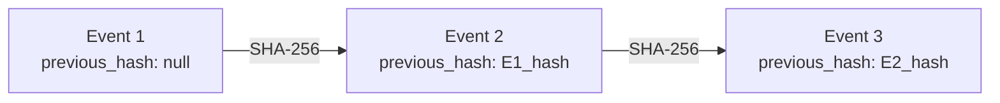

# Cryptographic Audit Log Specification

LightGrant implements an event-sourced, cryptographic audit log to secure the integrity of all privilege changes and access requests.

---

## 1. Hash Chain Architecture

All audit events are stored sequentially in the SQLite database table `audit_events`. To detect deletion, insertions, or updates in the database, each event is cryptographically linked to the previous one, forming a hash chain.

### Hash Calculation
For each new event, the system:
1. Resolves the `event_hash` of the immediately preceding event record (based on `sequence_number` order). This is assigned as the `previous_hash` of the new record.
2. Constructs a JSON payload containing the database fields:
   - `event_id`
   - `event_type`
   - `actor_type`
   - `actor_id`
   - `github_org_id`
   - `github_user_id`
   - `github_team_id`
   - `grant_id`
   - `payload_json`
   - `previous_hash`
   - `created_at`
3. Sorts the keys of the JSON payload alphabetically (Canonical JSON format) to guarantee deterministic serialization across environments.
4. Computes the SHA-256 hash of the canonical JSON string. The output digest is saved in the record's `event_hash` column.

---

## 2. Supported Audit Events

The system logs the following core business events:

| Event Type | Description | Trigger Point |
|---|---|---|
| `access_requested` | A user requests temporary access via Slack command. | JIT Access Request Submission |
| `request_approved` | An approver grants the request or auto-approval rules are met. | Request Approval |
| `request_denied` | An approver rejects the access request. | Request Denial |
| `grant_access` | The JobWorker attempts to add the user to the GitHub team. | Entitlement Addition |
| `grant_revoked` | The scheduler successfully removes the user's temporary access. | Access Revocation |
| `grant_revocation_failed` | An error occurs during revocation (retried automatically). | Revocation Failure |
| `policy_updated` | A team Maintainer updates or creates an access policy. | Policy Modification |
| `identity_linked` | A user completes the GitHub OAuth identity linkage flow. | Identity Mapping |
| `team_cache_synchronized` | The background scheduler completes a team cache refresh sync. | Regular Team Sync Tick |

---

## 3. Integrity Verification

To verify that the audit log has not been tampered with, the system performs a sequential verification check:

1. Starts at the oldest event record (`sequence_number = 1`).
2. Confirms that `previous_hash` is `null`.
3. Re-computes the SHA-256 hash from the record fields and matches it with the stored `event_hash`.
4. Moves to the next record (`sequence_number = 2`).
5. Confirms that its `previous_hash` matches the `event_hash` of record `1`.
6. Repeats the check for all subsequent records in ascending order.

This verification is accessible via:
- **Diagnostic Dashboard**: Visiting `GET /setup` triggers a live verification and reports the outcome.
- **Unit/Integration Tests**: Executing `npm run test` runs verification checks against mock databases.
